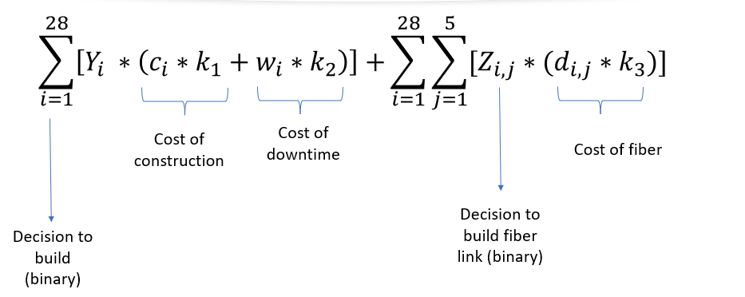
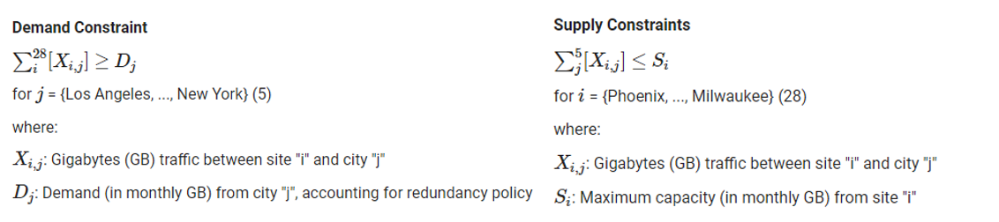
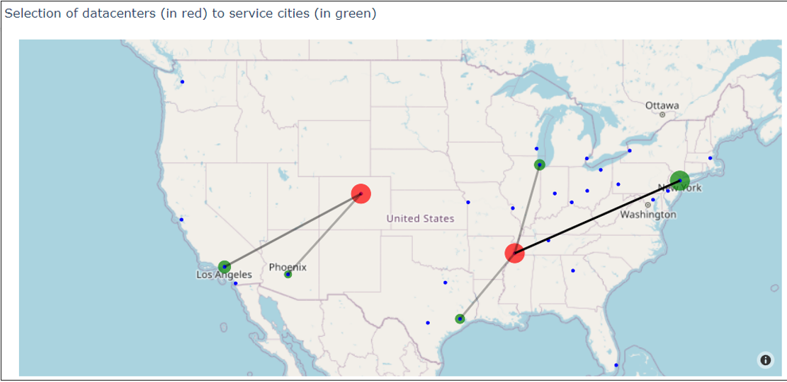

# Data Center Site Selection

This Python Notebook shows the technical implementation of a mixed-integer programming model in GurobiPy.
Its objective is to minimize the cost of a data center site selection. 

## [View Python Notebook](https://carlosfg97.github.io/DataCenterSiteSelection/DataCenterSiteSelection_GurobiPy.html)

**Authors: L. D'hulst, C. Fabbri, S. Gupta, N. Hamra, R. Mukena**

Costs are minimized in terms of:
 - Construction index (state estimate)
 - Distance between site and cities
 - Cost of construction, cost of fiber, cost of downtime

While minimizing cost, several constraints are considered related to :
 - Temprature
 - Severity of Weather
 - Demand and Supply

The notebook is very graphical and shows the original results as well as alternative scenarios in interactive maps using Plotly.

Under the current optimal solution, the model finds Denver and Memphis as the best configuration of sites to service Houston, Chicago, New York, Los Angeles and Phoenix.

Done as part of McGill's Masters of Management in Analytics
